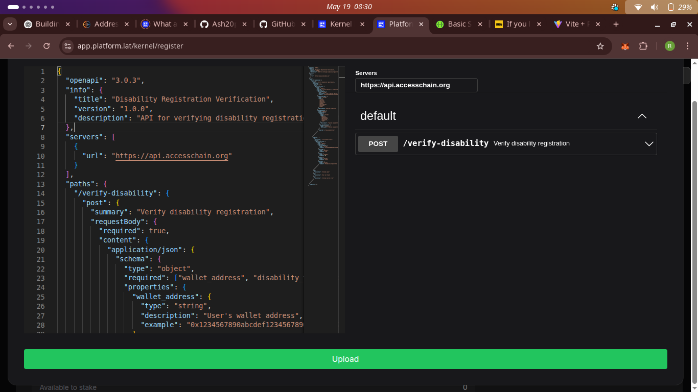
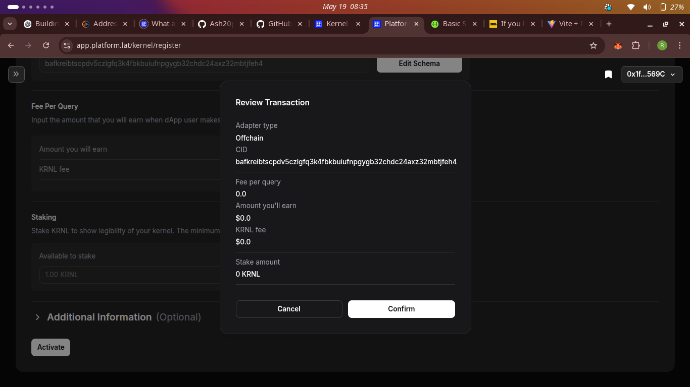
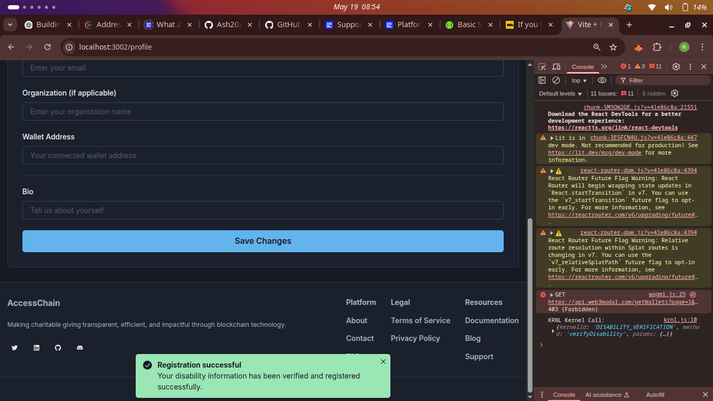
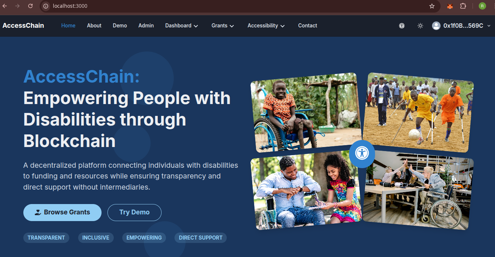
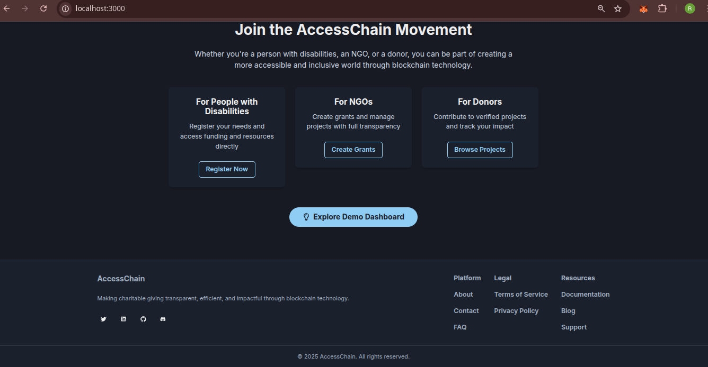
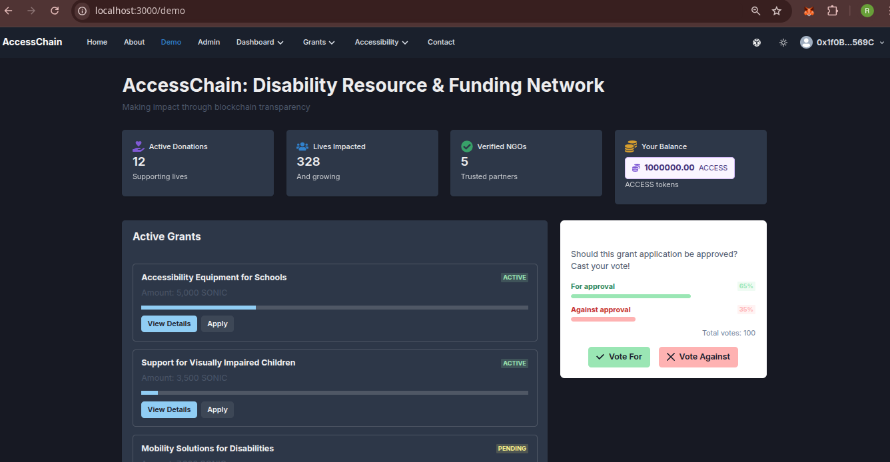
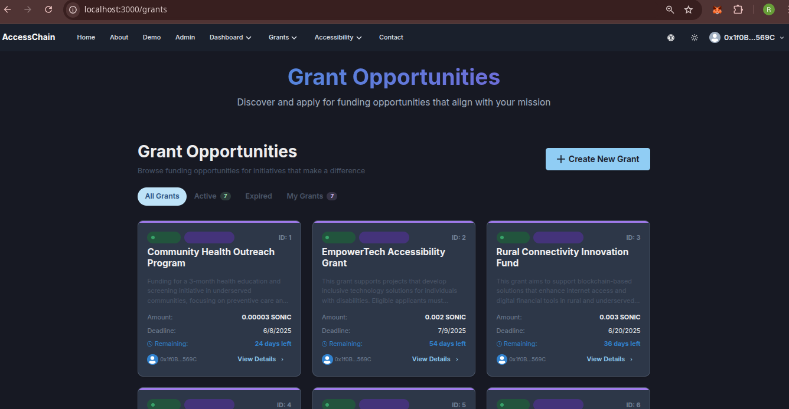
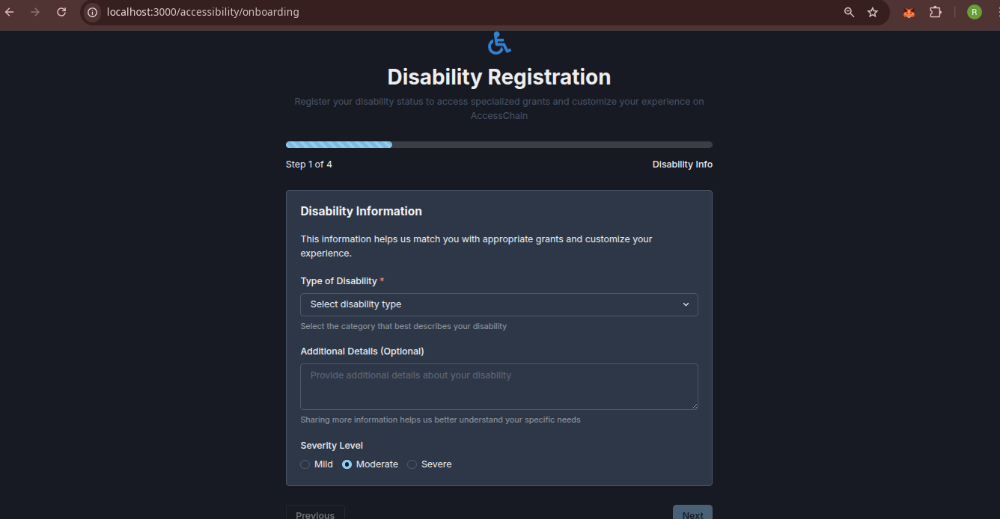

# Team-AccessChain

## Overview
AccessChain is a blockchain-based platform that connects people with disabilities to funding and resources through transparent grant management. It eliminates intermediaries, ensuring direct support reaches beneficiaries while providing NGOs with efficient tools to create and manage disability support grants.

## Features
✅ On-chain disability verification and registration
✅ NGO verification and grant management system
✅ Direct funding between donors and beneficiaries
✅ Community voting on grant applications
✅ ACCESS token integration for governance
✅ Accessibility-first design for all users

## KRNL Integration
AccessChain leverages KRNL kernel technology for enhanced disability verification and resource distribution.

### KRNL Screenshots




### Current KRNL Implementation
1. **Disability Verification**
   - KRNL kernel-based verification system
   - Secure documentation handling
   - Real-time verification status updates
   - Kernel ID and CID tracking

2. **Resource Matching**
   - AI-powered grant matching
   - Personalized resource recommendations
   - Multi-factor matching algorithm

3. **Impact Analysis**
   - Grant effectiveness tracking
   - User outcome analysis
   - Resource utilization metrics

### Future KRNL Implementations
1. **Advanced Verification**
   - Batch verification for organizations
   - Multi-level verification process
   - Automated documentation verification
   - Integration with medical providers

2. **Smart Contract Integration**
   - Grant distribution automation
   - Token-based rewards
   - Governance mechanisms
   - Verification status updates

3. **Enhanced Resource Matching**
   - Machine learning-based matching
   - Real-time availability updates
   - Cross-platform resource sharing
   - Success rate optimization

## Project Structure
- `contracts/`: Smart contracts for disability verification, grant management, and token functionality
- `accessFront/`: React-based frontend application with Chakra UI components
  - `src/config/krnl.js`: KRNL client configuration
  - `src/hooks/useKrnl.js`: KRNL integration hooks
  - `src/context/AccessibilityContext.jsx`: KRNL state management
- `scripts/`: Deployment and configuration scripts
- `test/`: Contract test files
- `assets/`: Design assets and images
- `docs/`: Additional documentation

## Tech Stack
- Solidity + Hardhat
- React + Chakra UI
- Wagmi v2 / Ethers.js
- MetaMask integration
- Sonic Blaze Testnet
- KRNL Kernel Technology

## How to Run Locally
1. Clone the repo
```shell
git clone https://github.com/Blockbridge-Network/Team-AccessChain-Core.git
cd Team-AccessChain-Core
```

2. Install dependencies
```shell
npm install
cd accessFront
npm install
```

3. Configure MetaMask for Sonic Blaze Testnet
   - Network Name: Sonic Blaze Testnet
   - RPC URL: https://rpc.blaze.soniclabs.com
   - Chain ID: 57054
   - Currency Symbol: SONIC

4. Configure KRNL Environment Variables
```env
REACT_APP_KRNL_API_KEY=your_api_key
REACT_APP_KRNL_ENVIRONMENT=development
```

5. Start the development server
```shell
cd accessFront
npm run dev
```

## Contracts
| Contract | Address | Network |
|----------|---------|---------|
| NGOAccessControl | 0x16788aD7d27A8e244BEbF1cdc3906b43f7f66f80 | Sonic Testnet |
| RequestRegistry | 0xC880064656D06317A55EC3cD9036D8CE8E217497 | Sonic Testnet |
| AccessGrant | 0x1eA07a7e5Fc838146E9de9F801d50f3F896a6587 | Sonic Testnet |
| AccessToken | 0xd4F4B93aD2Fb9a543a74a9C5aad334cAd47B5a4B | Sonic Testnet |
| AccessNFT | 0x9C270EA210E741B550bF822625694D0f64c71492 | Sonic Testnet |
| AccessDAO | 0x0081FB567ae0851f8fa47E39c6e3882e9f91e10F | Sonic Testnet |

## 📸 Screenshots







## 🎥 Demo Video
[Watch our demo video](https://vimeo.com/1084558401/d69f80400a) to see AccessChain in action.

## Team
- Richmond Andoh (Full-Stack Developer)
- Agyemang Nana Akua (Frontend Developer)
- Adwoa Favour (UI/UX Designer)

## 📄 License
MIT

## DAO Structure
AccessChain operates as a decentralized autonomous organization (DAO) to ensure transparent and community-driven governance:

### Governance Model
- **Token-Based Voting**: ACCESS token holders can vote on key platform decisions
- **Proposal System**: Community members can submit and vote on proposals
- **Treasury Management**: Transparent fund allocation for platform development
- **Stakeholder Representation**: Equal voice for beneficiaries, NGOs, and donors

### DAO Features
- Proposal creation and voting
- Fund allocation tracking
- Community-driven feature development
- Transparent decision-making process

## Live Demo
Experience AccessChain's features firsthand:
- [AccessChain Live Demo](https://accesschain.vercel.app)
- [Test User Credentials](https://github.com/Blockbridge-Network/Team-AccessChain-Core/wiki/Test-Accounts)

## Business Model
AccessChain's sustainable business model focuses on long-term impact while ensuring platform sustainability:

### Revenue Streams
1. **Platform Fees**
   - Small transaction fee (0.5%) on successful grant distributions
   - Premium features for NGOs and organizations
   - API access for third-party integrations

2. **Token Economics**
   - ACCESS token utility in governance
   - Staking rewards for long-term holders
   - Token-based premium features

3. **Partnership Revenue**
   - Integration fees from partner organizations
   - Custom solution development
   - Enterprise licensing

### Sustainability
- 70% of platform fees allocated to development
- 20% to community rewards and incentives
- 10% to operational costs

### Impact Metrics
- Number of beneficiaries supported
- Success rate of grant applications
- Community engagement levels
- Platform adoption metrics
